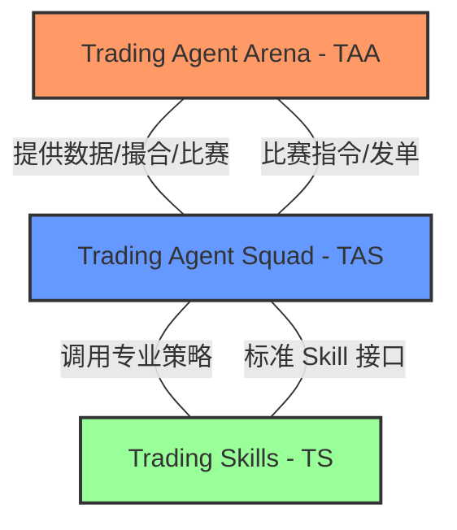

# Trading Agent (TA) - 架构总览 (Architecture Overview)

> **版本**: 1.0
> **最后更新**: 2026-02-26

## 1. 核心理念：三足鼎立 (The Three Pillars)

为了解决量化交易系统中常见的“逻辑耦合”与“难以扩展”问题，TA 架构将系统垂直切分为三个独立且互补的项目：



### 1.1 TAA (Trading Agent Arena) - 竞技场与基建
- **角色**：作为“游戏服务器”。
- **职责**：
  - 数据管理：加载历史 CSV、接入实时 Websocket。
  - 时间流转：Virtual Clock 驱动，支持回测加速与实盘同步。
  - 模拟撮合：严谨的挂单撮合机制、滑点模块、手续费计算。
  - 比赛评价：自动生成收益率、夏普比率等排位榜单。

### 1.2 TAS (Trading Agent Squad) - 交易助理小队
- **角色**：作为“玩家/指挥部”。
- **职责**：
  - 智能体协作：基于 AAAgent 框架，管理 PA、技术员、宏观员等角色间的共识与辩论。
  - 记忆系统：管理长期与短期记忆。
  - 决策执行：汇集各方情报，通过标准接口调用 TAA 进行交易。

### 1.3 TS (Trading Skills) - 策略武器库
- **角色**：作为“技能工具箱”。
- **职责**：
  - 标准化封装：遵循 Anthropic Skills 标准。
  - 策略逻辑：将具体的算法（如 Grid RSI, MACD, 情感分析）封装为无状态的工具。
  - 市场化潜力：未来可作为独立的 Skill Market 模块，供不同的小队订阅。

---

## 2. 协作与开发模式 (VibeCoding)

项目采用 **文档驱动开发 (DDD - Documentation Driven Development)**。即使是在跨电脑开发时，Agent 只需阅读以下文件即可快速进入战斗：

1. **`ta/docs/HANDOVER.md`**: 全局进度与决策快照。
2. **各子项目 `docs/task/BOARD.md`**: 详细的战术执行看板。
3. **`docs/COLLABORATION_GUIDE.md`**: AI 助手的行为准则。

## 3. 物理存储结构

```text
C:\projects\ta\ (Meta-repo)
├── docs\ (全局文档与架构)
├── TradingAgentArena\ (Submodule)
├── TradingAgentSquad\ (Submodule)
└── TradingSkills\ (Submodule)
```

## 4. 后续演进

- [ ] 实现 TAA 的第一套标准化回测接口。
- [ ] 完成 Grid RSI 的首个符合 Anthropic Skills 标准的 Skill 封装。
- [ ] 实现 TAS 与 TAA 的跨项目握手。
