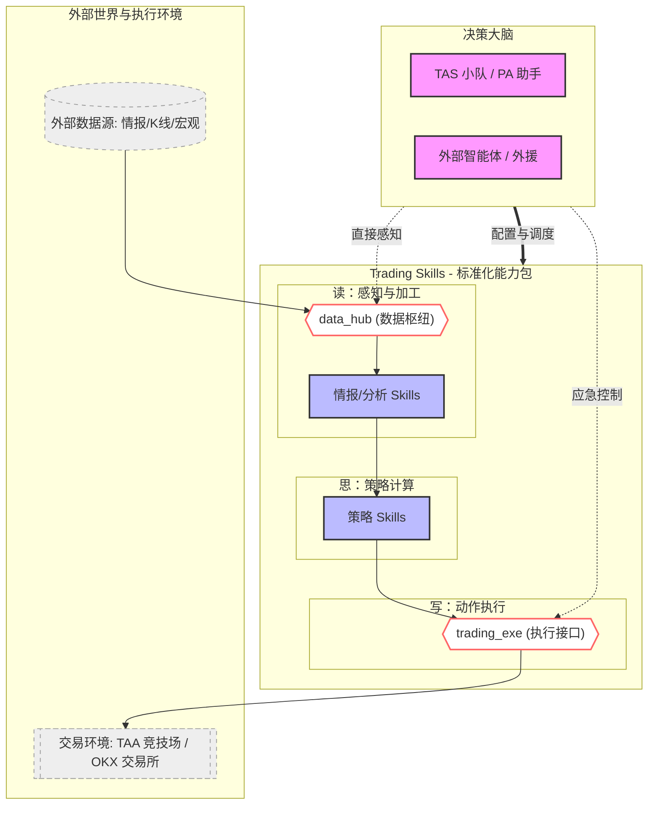

# INS-002: 系统概念架构全景 (System Conceptual Architecture)

> **状态**: 🟢 ACTIVE
> **版本**: 1.1
> **更新日期**: 2026-02-27

## 1. 核心交互逻辑

本架构旨在将“交易行为”抽象为标准的读写流。在大模型（Agent）的视角下，系统由**决策大脑**、**标准化能力包**与**物理执行环境**三部分组成。

## 2. 模块分层解析

### 2.1 数据的流转 (感知层)
- **外部数据源 (Sources)**：提供原始的、未经处理的情报（如 K 线、社交媒体文本、新闻）。
- **data_hub (读标准)**：数据的过滤器。它将杂乱的外部数据统一为 Agent 和策略能够识别的标准数据包。
- **情报分析 (Info Skills)**：数据的加工厂。它负责把原始数据提炼为“情绪指数”、“压力位”、“加息概率”等高阶特征。

### 2.2 策略的执行 (逻辑层)
- **策略 Skills (Strategy)**：系统的灵魂。它接收加工后的情报，计算网格间距、止盈止损位等具体的交易决策。
- **trading_exe (写标准)**：动作的承兑商。它将策略生成的逻辑指令（如“在 60000 买入”）转化为真实世界中交易所能识别的 API 请求。

### 2.3 指挥中心 (决策层)
- **TAS / OpenClaw**：它们是这一切的调度者。它们通过阅读 Skill 的说明书，决定什么时候开启哪个策略，以及什么时候需要人力/外部智能体介入。

---

## 3. 设计优势：极度简化

1. **即插即用**：你可以更换任何一个 `Strategy` 而不影响底层的 `trading_exe`。
2. **多源透明**：你可以接入任何 `Source`，只要给它写一个 `data_hub` 的适配器，所有策略都能瞬间获得新的视野。
3. **跨 Agent 兼容**：只要 Agent 满足“能识别并调用 Skill”这一标准，不论是自研的 TAS 还是外部的 OpenClaw，都能无差别地使用这套“交易武器库”。
